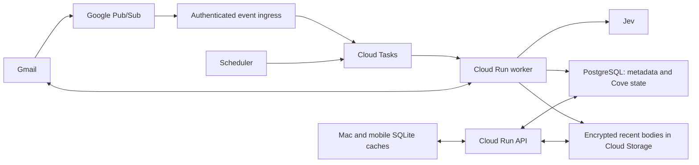

# Cove backend plan

> Implementation update (September 25, 2026): the first opt-in Mac-to-cloud recent-mail pilot is implemented in [backend/README.md](../backend/README.md). PlanetScale tables and Google Cloud API/storage/KMS are provisioned. This is the limited device-upload phase; the larger server Gmail push/worker architecture below remains a future plan. No user mailbox is uploaded until cloud sync is enabled in the signed app.

Plan researched 22 September 2026. The user has provisioned PlanetScale `cove` PostgreSQL in AWS us-east-1; MCP read-only discovery confirms it is ready. No Cove backend is deployed, and no email has been uploaded to it.

## Recommendation

Use **Google Cloud Run + PlanetScale Postgres**, following the user's provider preference. The existing personal-pilot database has one **PS-5 ARM single-node** branch in AWS us-east-1, confirmed through MCP read-only inspection. [Database research](DATABASE_RESEARCH.md) retains eight alternatives. Keep Gmail Pub/Sub notifications, Cloud Tasks, and Cloud Storage for encrypted recent bodies. Mac and mobile keep SQLite caches for offline use. Gmail remains authoritative for messages/labels; Cove owns preferences, classifications, snoozes, contacts, and local drafts. The user has provisioned the database. Its compute matches the reference configuration; actual billing still includes any usage overages and taxes.

Postgres suits joins between messages, contacts, labels, and decisions, transactional job dispatch, reporting, and schema migrations. It also keeps the data model portable between managed PostgreSQL providers. Cloud Run hosts the API and worker with minimum instances zero; the database runs as a separate managed service, never inside an ephemeral Cloud Run container. [Cloud Run overview](https://docs.cloud.google.com/run/docs/overview/what-is-cloud-run)

| Database beside Cloud Run | Pilot cost basis | Tradeoff |
| --- | --- | --- |
| **PlanetScale Postgres — preferred pilot** | PS-5 single node starts at $5/month in AWS us-east-1; 512 MiB RAM and 1/16 vCPU. | Small capacity, no HA; confirm regional price and included allowances before deployment. [Catalog](https://planetscale.com/pricing.md) |
| **Supabase Free — alternative** | $0 database within free quotas: 500 MB DB, 1 GB object storage, 5 GB uncached egress. Pro starts at $25/month. | Shared compute, inactivity pausing, no included automatic backups; arrange exports and measure usage. [Pricing](https://supabase.com/pricing) |
| **Aiven Free / Developer** | Free: 1 GB DB. Developer starts at $5/month with 8 GB disk and basic backups. | Free has 20 connections and no managed pooling; inactivity shutdown. Developer stays on but remains single-node. [Free limits](https://aiven.io/docs/products/postgresql/concepts/pg-free-tier), [Developer](https://aiven.io/developer-tier-pg-mysql) |
| **Neon PostgreSQL — metered paid alternative** | Launch: $0.106/CU-hour and $0.35/GB-month, no monthly minimum. At 0.25 CU, 240 active hours is $6.36; 720 hours is $19.08, before storage/backups. | Managed, pooled connections, can suspend while idle; a second provider adds network and identity configuration. Frequent activity reduces idle savings. |
| **Cloud SQL for PostgreSQL** | Reference shared-core `db-f1-micro`: $0.0105/hour, about $7.56 per 30-day month, plus disk/backups/network. Allow roughly $10–15/month for a tiny database alone. | Keeps services in Google Cloud with IAM-based connectivity. The micro tier is a constrained pilot option without an SLA; a properly sized production/HA instance costs more. |

Neon Free provides 100 CU-hours/project and 0.5 GB/project, but exceeding compute allowances can suspend service and exceeding storage blocks writes. Use it for development, not as a guaranteed free always-on production budget. Launch suspends after five idle minutes unless disabled; mail arrival, reconciliation and device requests can keep it awake. [Neon pricing](https://neon.com/pricing), [Scale to zero](https://neon.com/docs/introduction/scale-to-zero)

Cloud SQL reference prices depend on region/configuration. Its tiny shared-core tier is not a like-for-like performance or availability comparison with larger Neon computes. Pick a larger instance after measuring workload. Cloud Run supports Cloud SQL connectors and recommends colocating services. [Cloud SQL pricing](https://cloud.google.com/sql/pricing), [Shared-core limitations](https://docs.cloud.google.com/sql/docs/postgres/faq), [Cloud Run connection guide](https://docs.cloud.google.com/sql/docs/postgres/connect-run)

## Monthly budget: preferred PlanetScale pilot

Use one PS-5 single-node branch as the $5/month reference configuration. Network-attached clusters include 10 GB disk; included backup storage is twice configured disk; PS-5 non-HA includes 10 GB monthly public egress. Stay within default storage/performance allowances and use the included local pooler. Extra branches each run a billed cluster, and dedicated poolers, larger compute and excess usage add cost. [PlanetScale pricing](https://planetscale.com/docs/postgres/pricing)

At the one-user Jev assumptions below, the starting model is **$5 database + approximately $0.66 Jev + Google services/any overages per month**. It is not a fixed total bill. Measure capacity before adding users: the $5 instance has very little CPU and no redundant replica for availability. Keep development on local PostgreSQL, queue bursts and cap worker concurrency. Choose nearby Cloud Run and database regions after checking the actual SKU rate and cross-cloud traffic costs.

## Monthly budget: alternative paid Neon scenarios

For a free-tier pilot, the database can cost **$0 even while Cove is operating**. Add Jev and separate Google/backup charges; do not apply the following paid-Neon totals to Supabase Free or Aiven Free. See [the free-tier capacity and cost model](DATABASE_RESEARCH.md#capacity-and-cost-assumptions-for-the-pilot). Launching the app does not itself require a paid plan; capacity and reliability requirements determine the upgrade.

Estimates below are a planning model, not a provider quote. Assumptions: 30 days, 100 eligible emails per user daily, one Jev request per new message, 5,000 total billed input tokens per request, 5% retry allowance; 30-day body cache averaging 50 KB per message, attachments fetched on demand; up to two devices using incremental sync. No full historical classification, enterprise support, public-launch assessment fees, tax, domain registration, or development labor included.

| Connected users | Emails/month | Infrastructure allowance, including Postgres | Jev estimate | Combined planning range |
| --- | ---: | ---: | ---: | ---: |
| 1 | 3,000 | $7–29 | $0.66 | **$8–30/month** |
| 10 | 30,000 | $23–58 | $6.62 | **$30–65/month** |
| 100 | 300,000 | $64–163 | $66.15 | **$130–230/month** |

These replace the earlier Firestore estimate. The one-user range assumes a 0.25 CU Neon compute active 240–720 hours/month and about 1 GB database storage, plus Google services and backup overhead. Ten users assumes 0.25–0.5 CU mostly active; 100 users assumes 0.5–1 CU mostly active and 5–15 GB database storage. These compute sizes are costing scenarios, not validated capacity promises; expensive queries or sustained load may require more. All cohorts share one database, not one compute per user. Mobile polling can keep the database warm even when no new email arrives.

Jev calculation: `emails × 5,000 × 1.05 / 1,000,000 × $0.042`. TypeSafe currently charges $0.042 per million input tokens; output is free. The 5,000-token assumption means the **entire billed request**, not just the email: today's classifier repeats source text in state and passage-choice criteria. No representative measured token distribution is available for this plan, and Cove does not currently capture input usage. Extra questions, instructions, and retries change the estimate. Capture usage if supplied by the API; otherwise measure representative requests and reconcile provider billing before setting subscription prices. [TypeSafe model pricing](https://docs.typesafe.ai/models)

Infrastructure assumptions: choose nearby supported regions for Cloud Run and Neon, measure cross-provider latency and egress, and include both providers in incident/backup planning. Cloud SQL can use the same Google region. Budget approximately 10 row reads and 10 row writes per message including coordination, plus device reads; this is a capacity assumption, not per-query billing. Assume about three billed Cloud Run vCPU-seconds per processed message before concurrency savings. Network waiting during an active request can contribute to Cloud Run billing. Keep encrypted bodies in object storage and queryable metadata/decisions in Postgres. The 30-day body cache is approximately 150 MB per user before overhead.

Relevant allowances and expenses:

- Cloud Run request-based billing includes 180,000 vCPU-seconds, 360,000 GiB-seconds and 2 million requests monthly at the published reference pricing. Egress has separate charges. [Cloud Run pricing](https://cloud.google.com/run/pricing)
- Neon bills database compute/storage and separately charges restore-history and snapshot storage. Its published Launch restore-history rate is $0.20/GB-month and snapshot storage is $0.09/GB-month; 500 GB/project public network transfer is included, then $0.10/GB. Google-side egress is separate. Configure and test backups explicitly. [Neon pricing](https://neon.com/pricing)
- Pub/Sub's basic delivery allowance is 10 GiB/month; Cloud Tasks includes 1 million billable operations/month; three Scheduler jobs per billing account are free. Task creation and delivery both count. Use two shared schedules, not one schedule per user. [Pub/Sub](https://cloud.google.com/pubsub/pricing), [Tasks](https://cloud.google.com/tasks/pricing), [Scheduler](https://cloud.google.com/scheduler/pricing)
- Software KMS key versions cost $0.06/month and symmetric operations $0.03/10,000. Secret Manager includes six active versions and 10,000 accesses monthly. Allow for object storage, backups, artifact retention, logging and outbound traffic. [KMS](https://cloud.google.com/kms/pricing), [Secret Manager](https://cloud.google.com/secret-manager/pricing), [Storage](https://cloud.google.com/storage/pricing)

At 100 users, three vCPU-seconds/message gives roughly 900,000 vCPU-seconds monthly, so compute is no longer entirely covered by the free tier. That cohort averages 10,000 emails/day (0.12/second) and about 100,000 database writes/day under this model; queue burst capacity must be load-tested. Free allowances may already be consumed by other projects on the billing account. Add budget alerts, per-account processing limits, bounded backfills, maximum instances and queue dispatch limits. Billing alerts are notifications, not a hard spending cap. [Budget behavior](https://docs.cloud.google.com/billing/docs/how-to/budgets)

## Architecture and synchronization

Use one backend codebase deployed as public API and private worker services, with separate service identities. Start without Redis, Kubernetes, a vector database, full-text cloud indexing, or permanent attachment storage.

1. After cloud opt-in, establish a mailbox-wide `watch`, store its expiry, and renew daily. The topic's project must match the project executing `watch`; grant Gmail's documented publisher identity only topic-publish access. Notifications contain mailbox identity and a history ID, not email bodies. Acknowledge only after durable work is recorded. [Gmail push guide](https://developers.google.com/workspace/gmail/api/guides/push)
2. Treat notifications as hints. Lease work per mailbox; fetch every history page from the **last committed** cursor. Upsert changed messages/labels and tombstone deletions. Advance the cursor only after all relevant changes and Jev outbox entries are durable. Never replace it with an unprocessed notification or watch-renewal history ID. Chunk large reconciliations into resumable transactions. [Gmail synchronization](https://developers.google.com/workspace/gmail/api/guides/sync)
3. Use a daily renewal schedule and a shared 15-minute reconciliation/maintenance schedule. Notifications can be delayed or dropped; watches must be renewed within seven days. On an expired history cursor (`404`), rebuild the configured recent-mail window and reconcile already cached IDs, preserving drafts and Cove-owned state. [Push reliability](https://developers.google.com/workspace/gmail/api/guides/push), [History recovery](https://developers.google.com/workspace/gmail/api/guides/sync)
4. Transactionally create an outbox job with message persistence; dispatch it to Cloud Tasks, with a sweeper repairing dispatch gaps. Use `(accountID, GmailMessageID, contentVersion, policyVersion, modelVersion)` as a unique decision/job key. Duplicate deliveries and device requests reuse the same stored decision. A crash after a successful Jev call but before persistence may still repeat a billable call unless TypeSafe provides a supported idempotency facility; do not promise exactly-once billing.
5. Apply the existing new-mail activation cutoff and incoming-message exclusions. Keep existing 24 KB source and 8 KB instructions/memories bounds. Pin the evaluated Jev model, retry transient failures with jitter and provider guidance, pause revoked accounts, and expose failed jobs after a retry limit. Model scores never authorize sends or destructive actions.
6. Devices download a paginated Cove change feed using a separate server revision cursor. Include deletion tombstones and a full-refresh response for expired device cursors. Push notifications to mobile can be added later as an invalidation hint; foreground sync remains authoritative.

Suggested records: users (stable identity), connected accounts (owner, scope grant, encrypted credentials, cursor, watch expiry, processing owner), messages (Gmail ID, labels, dates, encrypted headers/body pointer), decisions (scores, encrypted excerpt, model/policy versions), drafts, contacts, preferences, jobs/outbox, device cursors, and tombstones. Persist typed relational rows rather than importing today's mailbox JSON snapshot as a single JSONB value. Use revision checks for conflicting draft edits and keep both versions for user recovery.

## SQL model and operation

- Start with `users`, `accounts`, `messages`, `message_labels`, `contacts`, `message_participants`, `decisions`, `drafts`, `preferences`, `outbox_jobs`, `device_changes`, and `tombstones`. Include ownership columns, tenant-scoped foreign keys and uniqueness constraints. Use JSONB for evolving provider details, with core query fields typed and indexed.
- Example queries: unread mail needing action from known contacts; message frequency by contact; urgency/category trends; failed processing jobs and average latency. Join on stable contact/message IDs. Do not expose arbitrary SQL execution to mobile or model tools.
- Keep bodies, subjects, email addresses, notes and excerpts envelope-encrypted. Useful SQL over dates, labels, categories, scores and relationship IDs remains possible. Use a keyed lookup digest for normalized-address matching when needed, and document the equality information it reveals. Arbitrary full-text/name search over ciphertext is not available: start with local search; a server text index would require a separate, explicit security design. Do not claim encryption and unrestricted content SQL simultaneously.
- Use PlanetScale's included local PgBouncer on port 6432 for API/worker traffic and direct primary port 5432 for migrations, exports and operations needing session state. Keep application pools small, cap instances/concurrency, set timeouts, and release DB connections before Gmail/Jev calls. All managed PlanetScale poolers use transaction mode: do not rely on session-level settings or session advisory locks; use transaction-local owner context, durable leases and fencing tokens. No dedicated paid pooler is planned initially. [PlanetScale connections](https://planetscale.com/docs/postgres/connecting)
- Keep credentials in Secret Manager, require certificate-verified TLS, and rotate database passwords. The pilot uses an authenticated public TLS endpoint; private networking is not assumed in the $5 baseline. Devices access Cloud Run only. Confirm restricted runtime roles and RLS behavior against PlanetScale during synthetic integration tests before importing user data.
- Store mail changes, revision entries and outbox records in the same transaction. Ensure the device change cursor follows commit visibility (for example, serialize revision allocation per account); a bare sequence can allocate IDs out of commit order and cause clients to miss changes. Apply schema migrations through a controlled deployment job; test forward migrations, restores, and tenant isolation on synthetic data first.

## Authentication, isolation and privacy

- Create a **Web application OAuth client** for the backend with an exact HTTPS callback. Request offline access through Google's supported server flow. Bind state and the verified identity to the connection; check issuer, audience, expiry and nonce where applicable. Use stable Google `sub`, not a supplied email address, as identity. Desktop/mobile receive a short-lived, one-use completion code bound to their initiating session; provider refresh tokens never travel in a redirect URL. Store only Cove session credentials in device Keychain. Reconnect explicitly for cloud mode; do not silently upload today's desktop refresh token. [Server OAuth](https://developers.google.com/identity/protocols/oauth2/web-server), [OpenID Connect](https://developers.google.com/identity/openid-connect/openid-connect)
- Use maintained auth libraries, expiring revocable device sessions, rotation of session refresh credentials, and rate limiting. Separate Google sign-in from permission to connect a mailbox. Verify mailbox ownership before storing a grant. Start backend ingestion with `gmail.readonly`; add `gmail.modify` only when cloud mutations are implemented. Read-only remains a restricted scope.
- Every resource lookup must be scoped to the authenticated owner. Do not accept client-supplied owner IDs as authority. Devices access the API, never the database. Use explicit owner-scoped queries plus PostgreSQL row-level security on tenant tables, with a non-owner runtime role that cannot bypass RLS. Set verified owner context transaction-locally; pooled connections must never retain a previous user’s context. Use tenant-scoped foreign keys and cross-user negative tests. Table owners and privileged roles can bypass ordinary RLS, so migrations use a separate credential. Separate production and test projects, restrict operator access, and use workload identities instead of downloadable service-account keys. [PostgreSQL row security](https://www.postgresql.org/docs/current/ddl-rowsecurity.html)
- Require authenticated Pub/Sub push and Cloud Tasks calls. Verify the expected issuer/audience/service identity and subscription; a JSON email address is not proof of authorization. [Authenticated Pub/Sub delivery](https://docs.cloud.google.com/pubsub/docs/authenticate-push-subscriptions)
- Use TLS and application-layer envelope encryption for refresh tokens, bodies, headers, excerpts, drafts, and contact details. Use a maintained AEAD implementation, fresh data keys/nonces, account/resource identity as associated data, and separate KMS permissions for credential versus content access. Keep operational indexes minimal (opaque account/message IDs, timestamps, labels, scores); those indexes still reveal limited metadata. Put the app-level Jev key and OAuth client secret in Secret Manager. [Envelope encryption](https://docs.cloud.google.com/kms/docs/envelope-encryption)
- This is **not end-to-end encryption**: the authorized worker and Jev need readable text during processing. Disclose that clearly, verify TypeSafe retention/training/subprocessor terms before public launch, and do not log content, token responses, or authorization URLs. Audit access using opaque identifiers.
- Default body retention: 30 days; older bodies and attachments retrieved on demand. Retain Cove state while the account is connected, with user controls. Account deletion must stop watch/processing, revoke grants and device sessions, delete active data and keys, and prevent queued work from recreating it. Target active-data deletion within 24 hours and backup expiry within 30 days; verify actual provider lifecycle/soft-delete settings before promising those timelines. Keep a deletion ledger so restores cannot resurrect deleted users. Offer a distinct local-cache deletion choice on devices.

## Public launch requirement

The existing app requests `gmail.modify`, which is restricted; `gmail.readonly` is also restricted. Google states that storing or transmitting restricted-scope data on servers requires a security assessment. Public distribution therefore needs restricted-scope verification and, where applicable, an annual independent assessment. Sending Gmail content to Jev already makes this relevant even before Cove owns a server. Budget assessment work separately; there is no verified fixed assessment price in this estimate. [Gmail scopes](https://developers.google.com/workspace/gmail/api/auth/scopes), [Restricted-scope verification](https://developers.google.com/identity/protocols/oauth2/production-readiness/restricted-scope-verification)

Google documents exceptions for personal use and development/testing, among others. A small personally known pilot may fit an exception; that is not an exemption for a public mobile launch. Confirm the project's actual status and applicable requirements before onboarding strangers. Hosting with Google alone does not satisfy verification. [Verification exceptions](https://developers.google.com/identity/protocols/oauth2/production-readiness/restricted-scope-verification#exceptions)

## Implementation sequence

1. **Contract and synthetic backend:** add a `MailRepository` boundary around `AppStore`; define PostgreSQL migrations, tenant roles/policies, account IDs, commit-ordered revisions, jobs and device sync. Build API/worker locally with synthetic MIME fixtures and the existing sync/Jev behavior as reference. Define all infrastructure in code; no live mailbox needed.
2. **Personal cloud pilot:** deploy the reviewed stack, connect one account through the new consent flow, enable encrypted 30-day ingestion, push, renewal, reconciliation and Jev. Keep client mail mutations direct temporarily. Prove new mail is processed with Cove quit, duplicate notifications are harmless, and deleting a connection cancels queued work.
3. **Mac migration:** download server state into the existing per-account SQLite cache. Import user-approved local preferences, drafts, snoozes, contacts and compatible Jev decisions; fetch message bodies from Gmail. Use an explicit `processingOwner = local|server` transition and one activation cutoff to prevent both processors running. Preserve the desktop separation of mail synchronization from automatic Jev preferences. Rollback hands processing back to the Mac without deleting drafts.
4. **Mobile and public readiness:** reuse the API/change feed, add on-demand body/attachment retrieval and device push hints, then explicit mutation APIs with idempotency. Complete cross-account access tests, token-revocation tests, queue/crash recovery, cursor expiry, encryption-key rotation, backup restore/deletion tests, measured billing, privacy disclosures and applicable Google review before broader launch.

First deliverable should be phase 1 plus a reviewable deployment configuration. The first live milestone is one account receiving and classifying mail while the Mac app is closed.
